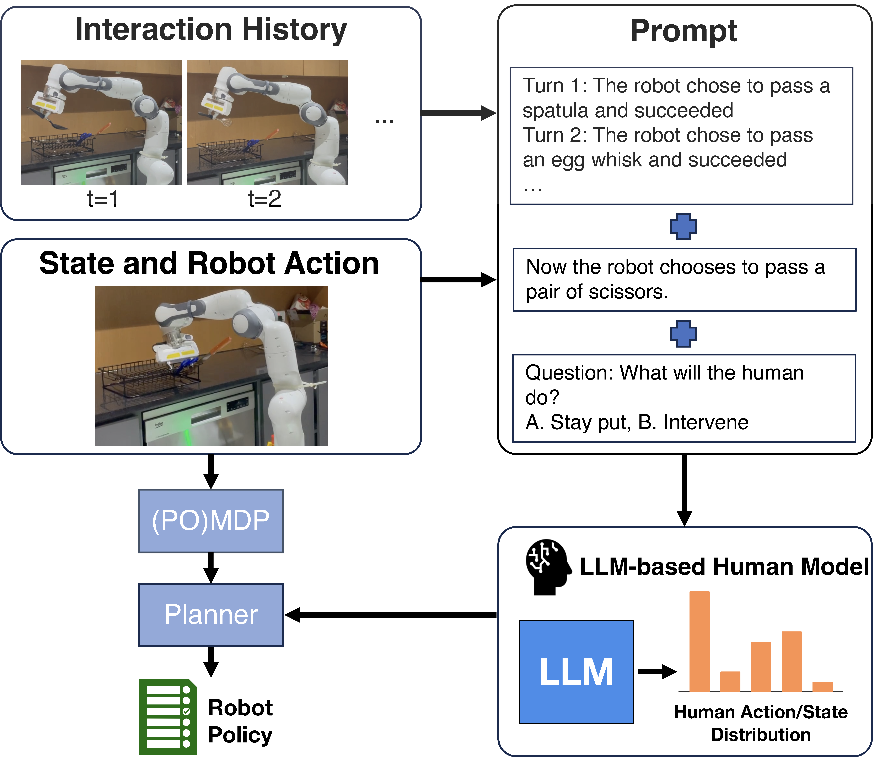

# Large Language Models as Zero-Shot Human Models for Human-Robot Interaction

This repository contains the supplementary material for our IROS 2023 paper [Large Language Models as Zero-Shot Human Models for Human-Robot Interaction](https://arxiv.org/abs/2303.03548).
```
@inproceedings{zhang2023large,
  title={Large language models as zero-shot human models for human-robot interaction},
  author={Zhang, Bowen and Soh, Harold},
  booktitle={2023 IEEE/RSJ International Conference on Intelligent Robots and Systems (IROS)},
  pages={7961--7968},
  year={2023},
  organization={IEEE}
}
```
**Please consider citing our work, if you found the provided resources useful.**

If you have any question, please leave an issue or directly contact [Bowen](mailto:bowenzhang@comp.nus.edu.sg).

## High-level Idea

Human models play a crucial role in human-robot interaction (HRI), enabling robots to consider the impact of their actions on people and plan their behavior accordingly. In this work, we explore the potential of large-language models (LLMs) to act as zero-shot human models for HRI. 

Here is a high-level illustration of how LLM-based human models can be used for planning in HRI:

<p align="center">
  
</p>

Our experiments on three social datasets yield promising results; the LLMs are able to achieve performance comparable to purpose-built models. Based on our findings, we demonstrate how LLM-based human models can be integrated into a social robot's planning process and applied in HRI scenarios. We present one case study on a simulated trust-based table-clearing task and replicate past results that relied on custom models. Next, we conduct a new robot utensil-passing experiment (n = 65) where preliminary results show that planning with a LLM-based human model can achieve gains over a basic myopic plan.

## Experiments results and reproducibility

The experiments on three social datsets: [MANNERS](https://www.frontiersin.org/articles/10.3389/frobt.2022.669420/full), [SocialIQA](https://arxiv.org/abs/1904.09728) and [Trust Transfer](https://arxiv.org/abs/1807.01866) and their results are in the respective folders. Each folder consists of a utility file and a Jupyter notebook that contains the instructions to reproduce the experiment results and evaluation results.

The case studies are stored in `table_clearing` and `utensil_passing` respectively. The `utensil_passing` folder also contains the crowdsourced results from questionnaires.